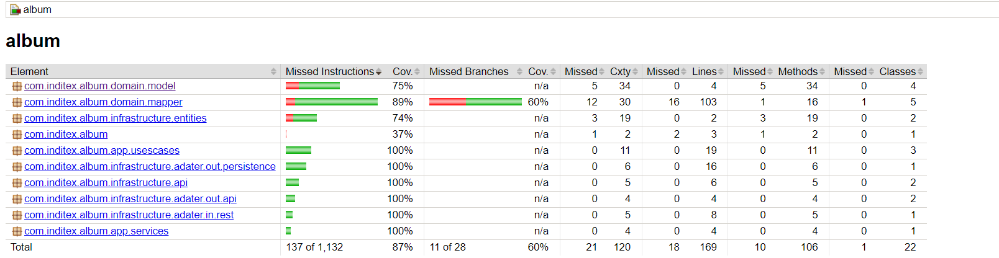

# Album-test
`Dev. Jean Quero`

Este microservicio está desarrollado con Spring Boot que es una herramienta que ayuda tener más rapidez a la hora de 
crear microservicios y aplicaciones web con Spring Framework, y además nos permite:

* Configuración automática. 
* Un enfoque de configuración obstinado. 
* La capacidad de crear aplicaciones autónomas.

La arquitectura usada fue la arquitectura hexagonal, esta arquitectura fue usada porque entre una de sus beneficios nos permite aislar
en capas, la aplicación y a si a la hora sé su mantenimiento sea más fácil como comprensible para los integrantes del equipo, 
a si como nos ofrece mayor facilidad a la hora de hacer pruebas, ya que cada capa de negocio está separada lo que la hace más 
flexible y escalable.

El API tiene 3 endpoints.

Lista de endpoints:

## POST

`Se tiene una Api con dos endpoind (https://jsonplaceholder.typicode.com/albums y https://jsonplaceholder.typicode.com/photos), los cuales son usados para que enriquezca una base dato.` [/api/v1/album]  

## GET

`Se tiene una Api con dos endpoind (https://jsonplaceholder.typicode.com/albums y https://jsonplaceholder.typicode.com/photos) los cuales son devueltos en la petición` [/api/v1/album/api]  
`Se obtienes los álbumes de la base de datos en memoria H2 ` [/api/v1/album]  

La aplicacion esta dockerizada, puede ejecutar la aplicacion siguiendo los siguientes pasos:

1. [x] 1: Posiciones en la carpeta raiz del proyecto
2. [x] 2: Ejecute el archivo run.sh

**Coverage 87%**

Primero Ejecute el comando
1. `mvn clean  test`

